# 🌊 Sonar Signal Classification System

## Rock vs Mine Prediction using Machine Learning

A production-style end-to-end Machine Learning application that classifies sonar signal returns as either **Rock** or **Mine** using a tuned **XGBoost Classifier**. The project demonstrates the complete machine learning lifecycle, from data preprocessing and model development to deployment through an interactive Streamlit web application.

The application supports both **single-sample** and **batch predictions**, includes **prediction confidence scores**, **SHAP explainability**, robust **CSV validation**, and **downloadable prediction reports**, making it a complete end-to-end ML deployment project.

---

# 🚀 Project Highlights

- ✅ End-to-End Machine Learning Pipeline
- ✅ Exploratory Data Analysis (EDA)
- ✅ Data Preprocessing
- ✅ Multiple Model Comparison
- ✅ Hyperparameter Tuning
- ✅ Tuned XGBoost Classifier
- ✅ Model Serialization
- ✅ Production Prediction Pipeline
- ✅ Interactive Streamlit Web Application
- ✅ Single Prediction
- ✅ Batch CSV Prediction
- ✅ Robust CSV Validation
- ✅ Prediction Confidence Visualization
- ✅ Excel Prediction Report Generation
- ✅ SHAP Explainability
- ✅ Modular Project Architecture
- ✅ Deployment Ready

---

# 📖 Project Overview

The **Sonar Signal Classification System** is a binary classification application developed using the **UCI Sonar Dataset**.

The objective of this project is to determine whether a sonar signal reflected from an underwater object belongs to a **Rock** or a **Mine** based on the returned acoustic energy measured across **60 different frequency bands**.

Rather than focusing solely on model training, this project demonstrates the complete workflow of building, evaluating, optimizing, deploying, and explaining a machine learning model using industry-standard practices.

The final application allows users to:

- Predict a single sonar sample
- Predict hundreds of samples using CSV upload
- View prediction confidence
- Understand model decisions using SHAP Explainability
- Download prediction reports

---

# 🎯 Project Objectives

The primary objectives of this project were to:

- Develop a reliable binary classification model
- Compare multiple machine learning algorithms
- Optimize model performance through hyperparameter tuning
- Build a reusable prediction pipeline
- Deploy the trained model using Streamlit
- Provide batch prediction capabilities
- Improve transparency through SHAP explainability
- Demonstrate an end-to-end production-ready ML workflow

---

# 📊 Dataset

### UCI Sonar Dataset

The project uses the **Connectionist Bench (Sonar, Mines vs Rocks)** dataset from the UCI Machine Learning Repository.

### Dataset Information

- Total Samples: **208**
- Total Features: **60**
- Feature Type: Numerical
- Target Classes:
  - **R → Rock**
  - **M → Mine**

Each feature represents the energy of a sonar signal within a specific frequency band.

Dataset Source:

https://archive.ics.uci.edu/dataset/151/connectionist+bench+sonar+mines+vs+rocks

---

# 🔄 Machine Learning Workflow

The project follows a complete end-to-end machine learning pipeline.

```
Dataset Collection
        │
        ▼
Exploratory Data Analysis (EDA)
        │
        ▼
Data Preprocessing
        │
        ▼
Model Comparison
        │
        ▼
Cross Validation
        │
        ▼
Hyperparameter Tuning
        │
        ▼
Final XGBoost Model
        │
        ▼
Model Evaluation
        │
        ▼
Model Serialization
        │
        ▼
Prediction Pipeline
        │
        ▼
Streamlit Web Application
        │
        ▼
Batch Prediction
        │
        ▼
SHAP Explainability
        │
        ▼
Deployment
```

---

# 🤖 Models Evaluated

During development, several machine learning algorithms were trained and compared.

- Logistic Regression
- Support Vector Machine (SVM)
- Decision Tree
- Random Forest
- XGBoost

After extensive experimentation and hyperparameter tuning, **XGBoost** achieved the best balance between predictive performance and generalization capability and was selected as the final production model.

---

# 📈 Model Performance

The final tuned **XGBoost Classifier** achieved excellent performance on the UCI Sonar dataset.

| Metric | Score |
|---------|-------|
| Test Accuracy | **92.86%** |
| Cross Validation Accuracy | **87.53%** |
| ROC-AUC Score | **0.980** |
| Average Precision | **0.980** |

These results indicate that the model performs reliably on unseen data while maintaining strong generalization.

---

# 💾 Saved Model Artifacts

The trained model and preprocessing objects were serialized for deployment.

Artifacts include:

```
artifacts/
│
├── tuned_xgboost_model.json
├── feature_order.pkl
├── feature_names.pkl
└── label_encoder.pkl
```

These artifacts ensure that predictions during deployment follow the exact preprocessing pipeline used during training.

---

# ✨ Features

## 🎯 Single Prediction

The application allows users to manually enter all **60 sonar feature values**.

Features include:

- Real-time prediction
- Rock / Mine classification
- Prediction confidence score
- Confidence progress bar
- Input validation
- Professional prediction interface

---

## 📂 Batch Prediction

Users can upload a CSV file containing multiple sonar samples.

Capabilities include:

- CSV Upload
- Automatic Validation
- Multiple Predictions
- Prediction Confidence
- Downloadable Excel Prediction Report

---

## 🛡 Robust CSV Validation

Before prediction, uploaded CSV files are automatically validated.

Validation includes:

- Empty file detection
- Feature count validation
- Missing value detection
- Numeric data validation
- Automatic handling of CSVs with or without headers

---

## 🧠 SHAP Explainability

To improve model transparency, SHAP Explainability has been integrated.

The application provides:

- Global Feature Importance
- SHAP Summary Plot
- Individual Prediction Explanation
- Feature Contribution Visualization

This helps users understand **why** the model produced a particular prediction.

---

# 🛠 Technology Stack

### Programming Language

- Python

### Data Processing

- Pandas
- NumPy

### Machine Learning

- Scikit-learn
- XGBoost

### Model Explainability

- SHAP

### Deployment

- Streamlit

### Utilities

- Joblib
- OpenPyXL
- Matplotlib

---

# 📂 Project Structure

```
 Rock_vs_Mine_Project/
│
├── app.py
├── README.md
├── requirements.txt
├── .gitignore
├── test_prediction.py
│
├── artifacts/
│   ├── tuned_xgboost_model.json
│   ├── feature_names.pkl
│   ├── feature_order.pkl
│   └── label_encoder.pkl
│
├── sample_data/
│   └── sample_batch.csv
│
├── utils/
│   ├── prediction.py
│   └── batch_prediction.py
│
├── assets/
│   └── screenshots/
│
└── notebooks/
```

---

# ⚙️ Installation

Follow the steps below to set up the project on your local machine.

### 1️⃣ Clone the Repository

```bash
git clone https://github.com/YOUR_GITHUB_USERNAME/Sonar-Signal-Classification-System_ML_Project.git
```

### 2️⃣ Navigate to the Project Directory

```bash
cd Sonar-Signal-Classification-System_ML_Project
```

### 3️⃣ Create a Virtual Environment

```bash
python -m venv venv
```

### 4️⃣ Activate the Virtual Environment

**Windows**

```bash
venv\Scripts\activate
```

**Linux / macOS**

```bash
source venv/bin/activate
```

### 5️⃣ Install the Required Dependencies

```bash
pip install -r requirements.txt
```

---

# ▶️ Running the Application

After installing all the required packages, launch the Streamlit application using:

```bash
streamlit run app.py
```

Once the server starts, open your browser and navigate to:

```
http://localhost:8501
```

The **Sonar Signal Classification System** will now be running locally, allowing you to perform:

- 🎯 Single Sonar Signal Prediction
- 📂 Batch CSV Prediction
- 📊 Prediction Confidence Visualization
- 🧠 Model Explainability
- 📥 Prediction Report Download

# 📸 Application Preview

Below are some screenshots showcasing the major features of the **Sonar Signal Classification System**.

---

## 🏠 Home Page

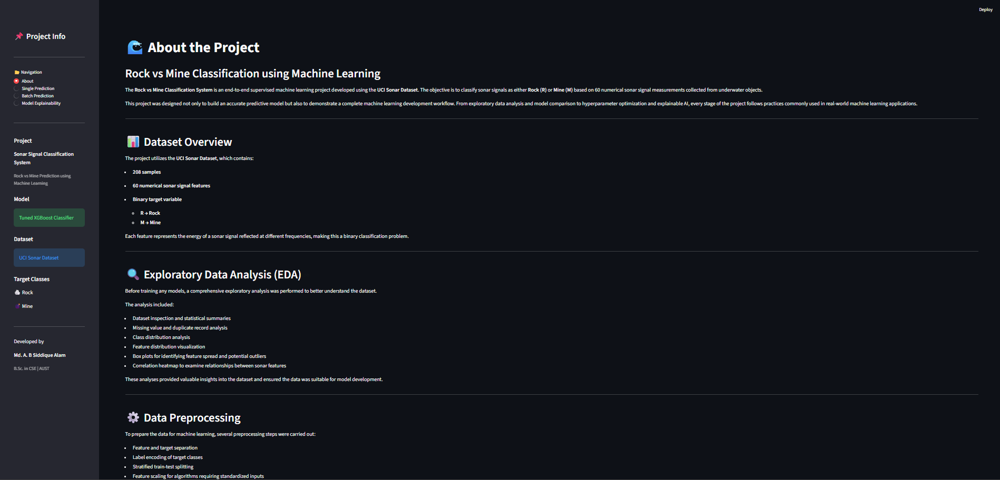

---

## 🎯 Single Prediction (Rock)

### Input Interface

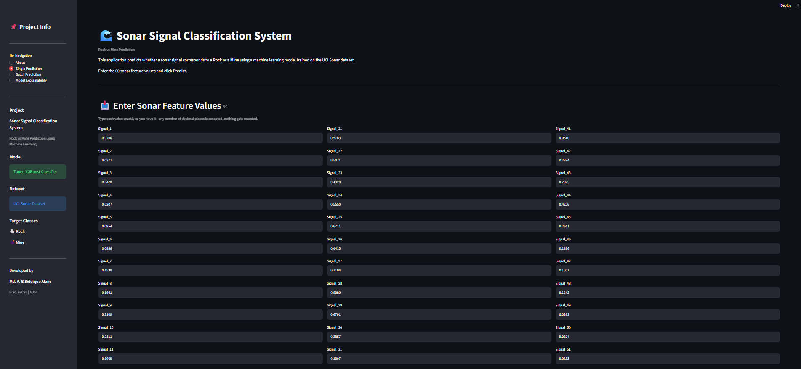

### Prediction Result

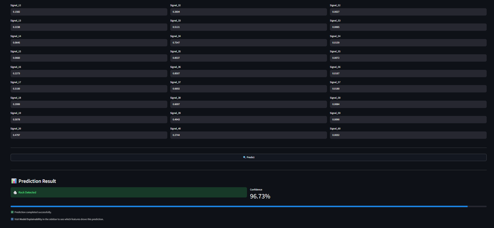

---

## 🧠 SHAP Explainability (Rock)

### Global Feature Importance

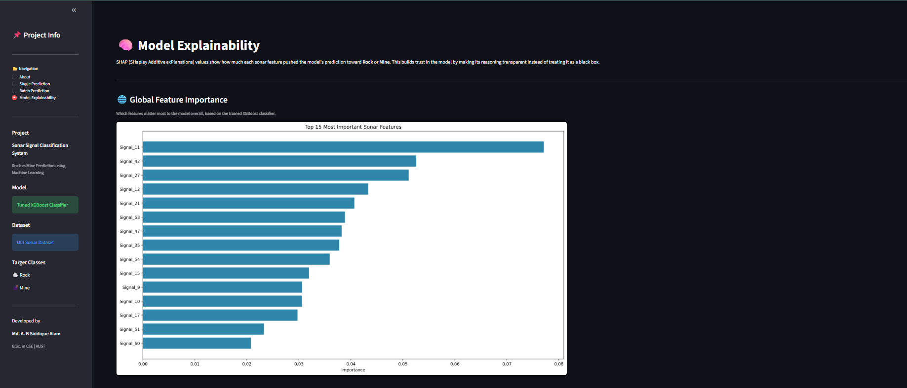

### Local Prediction Explanation

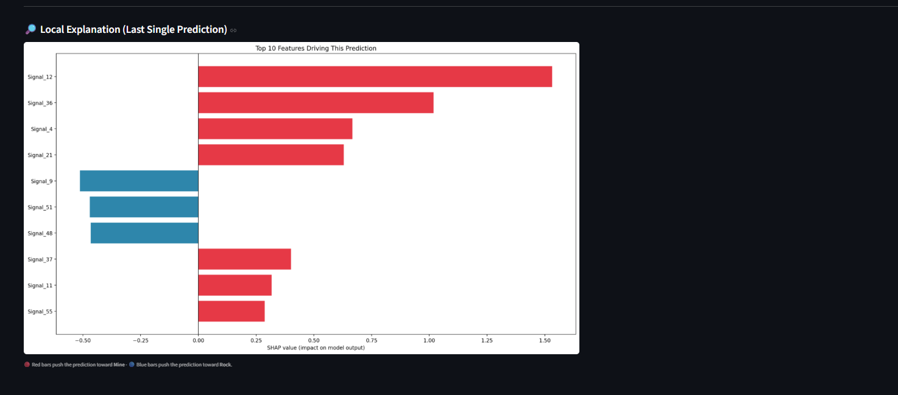

---

## 💣 Single Prediction (Mine)

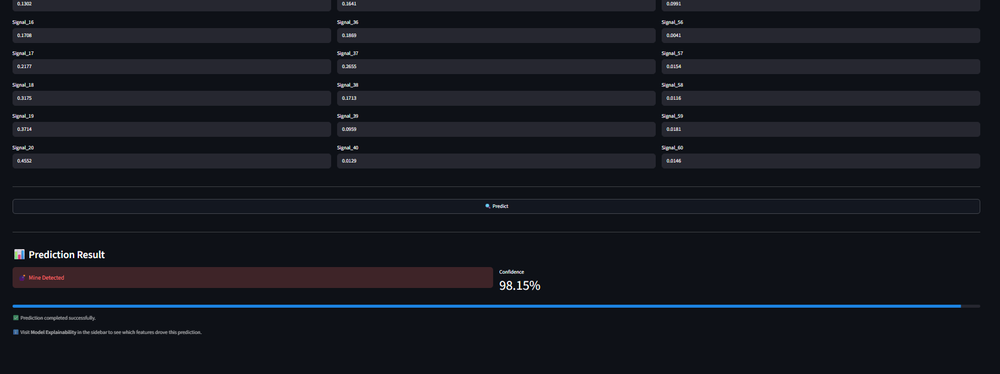

---

## 🧠 SHAP Explainability (Mine)

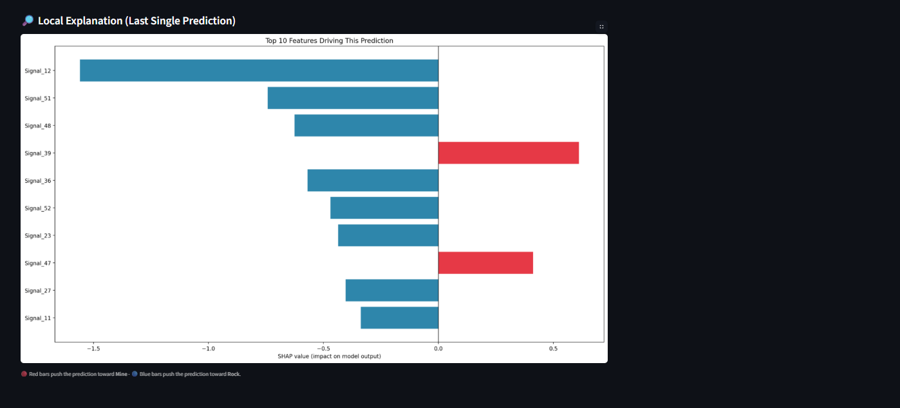

---

## 📂 Batch Prediction

### Upload CSV

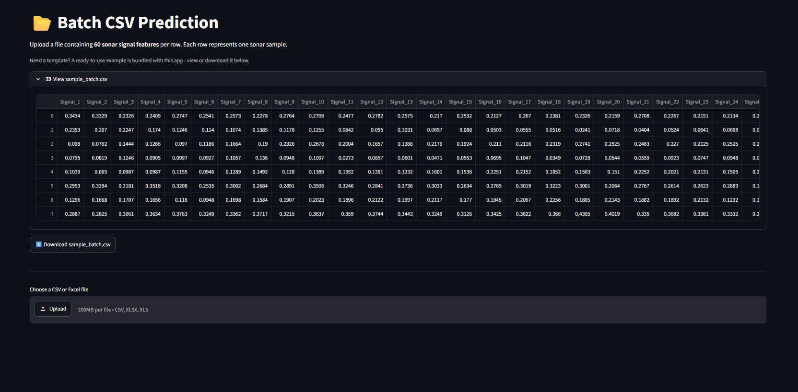

### Prediction Preview

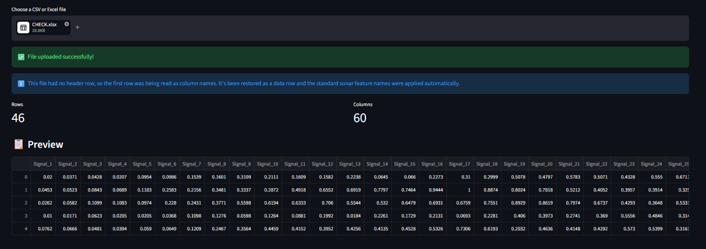

### Batch Prediction Result

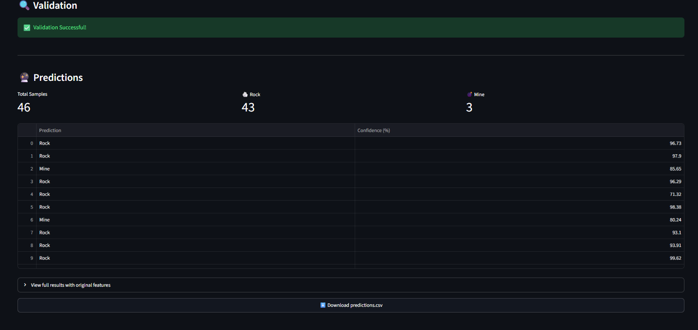

---

## 📄 Prediction Report

### Downloadable Report

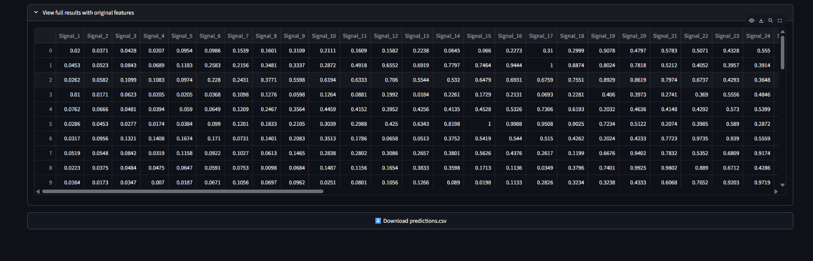

### Report Preview

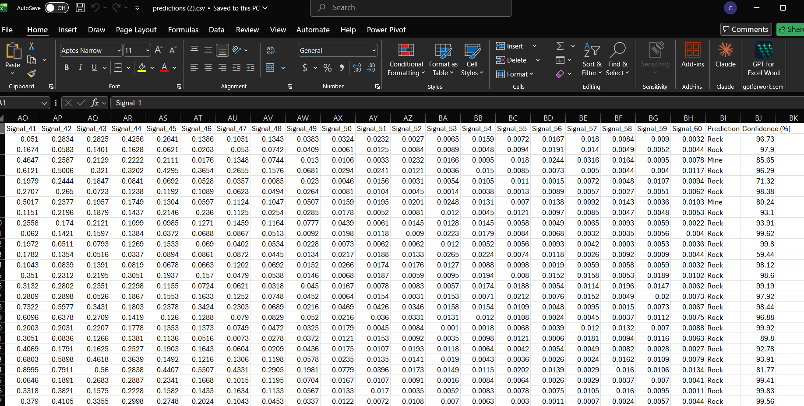

# 🌐 Live Demo

**Streamlit Cloud**

```
[https://your-app.streamlit.app](https://sonar-signal-classification.streamlit.app/)
```

---

# 🏗 Software Engineering Highlights

This project follows software engineering best practices by maintaining a modular and scalable architecture.

Key highlights include:

- Separation of UI and business logic
- Modular prediction pipeline
- Reusable utility functions
- Serialized model artifacts
- Robust exception handling
- Production-ready project organization
- Clean and maintainable codebase

---

# 🔭 Future Improvements

Potential future enhancements include:

- REST API using FastAPI
- Docker Containerization
- MLflow Experiment Tracking
- User Authentication
- Database Integration
- Prediction History
- Cloud Deployment on AWS, Azure, or GCP

---

# 👨‍💻 Developer

**Md. A. B Siddique Alam**

Bachelor of Science in Computer Science & Engineering

Ahsanullah University of Science & Technology (AUST)

GitHub:
https://github.com/Mabsas

LinkedIn:
https://www.linkedin.com/in/mohammad-sahil-49b713297/

---

# 📄 License

This project is licensed under the **MIT License**.

Feel free to use, modify, and distribute this project under the terms of the MIT License.
